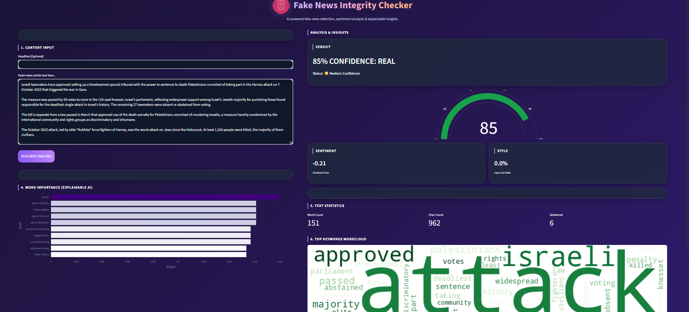

# Fake News Detection from Articles

A machine learning project for detecting fake news articles using Natural Language Processing (NLP), TF-IDF vectorization, and ensemble learning. The project includes a trained classification model and an interactive Streamlit web application for real-time predictions.

## Overview

The rapid spread of misinformation on digital platforms has made fake news detection an important challenge. This project applies classical Natural Language Processing (NLP) techniques and machine learning algorithms to classify news articles as **Real** or **Fake**.

The project covers the complete machine learning workflow, including data preprocessing, exploratory data analysis (EDA), feature engineering, model training, hyperparameter tuning, ensemble learning, and deployment of an interactive web application.

## Features

- Data preprocessing and text cleaning pipeline
- Exploratory Data Analysis (EDA)
- TF-IDF feature extraction
- Stylometric feature engineering
- Multiple machine learning models
- Hyperparameter tuning
- Weighted ensemble model (SVM + XGBoost)
- Model evaluation using multiple metrics
- Interactive Streamlit web application
- Real-time prediction interface
- Saved model and vectorizer for inference

## Technologies

- Python
- Scikit-learn
- XGBoost
- Pandas
- NumPy
- NLTK
- Streamlit
- Matplotlib
- Seaborn

## Machine Learning Models

The following models were trained and evaluated:

- Logistic Regression
- Multinomial Naive Bayes
- Random Forest
- Support Vector Machine (SVM)
- XGBoost
- Weighted Ensemble (SVM + XGBoost)

The final model is a weighted ensemble combining:

- **60% XGBoost**
- **40% SVM**

## Model Performance

| Model | Accuracy | F1-score |
|--------|----------|----------|
| Logistic Regression | 81.94% | 82.84% |
| Naive Bayes | 73.40% | 73.50% |
| Random Forest | 81.63% | 82.26% |
| SVM | 85.98% | 87.09% |
| XGBoost | 83.43% | 85.51% |
| **Weighted Ensemble** | **86.32%** | **87.55%** |

## Project Structure

```text
fake-news-detection/
│
├── app/
│   └── app.py                
│
├── src/
│   ├── data_collection.py
│   ├── preprocessing.py
│   ├── feature_engineering.py
│   ├── train_models.py
│   ├── hyperparameter_tuning.py
│   ├── ensemble.py
│   └── save_model.py
│
├── models/
│   ├── model.pkl
│   └── vectorizer.pkl
│
├── data/
│
├── notebooks/
│   └── news_classification_code.ipynb
│
├── screenshots/
│
├── train.py                  
├── requirements.txt
└── README.md
```

## Dataset

This project was developed using multiple public fake news datasets, including:

- ISOT Fake News Dataset
- WELFake Dataset
- LIAR Dataset

The datasets are **not included** in this repository because of their size.

## Installation

Clone the repository

```bash
git clone https://github.com/your-username/fake-news-detection.git
```

Install dependencies

```bash
pip install -r requirements.txt
```

Run the application

```bash
streamlit run app.py
```

## Application Preview
<p align="center">
  
</p>

## Author

**Zhuldyz Kaztayeva**

Bachelor's Student in Statistics and Data Science
